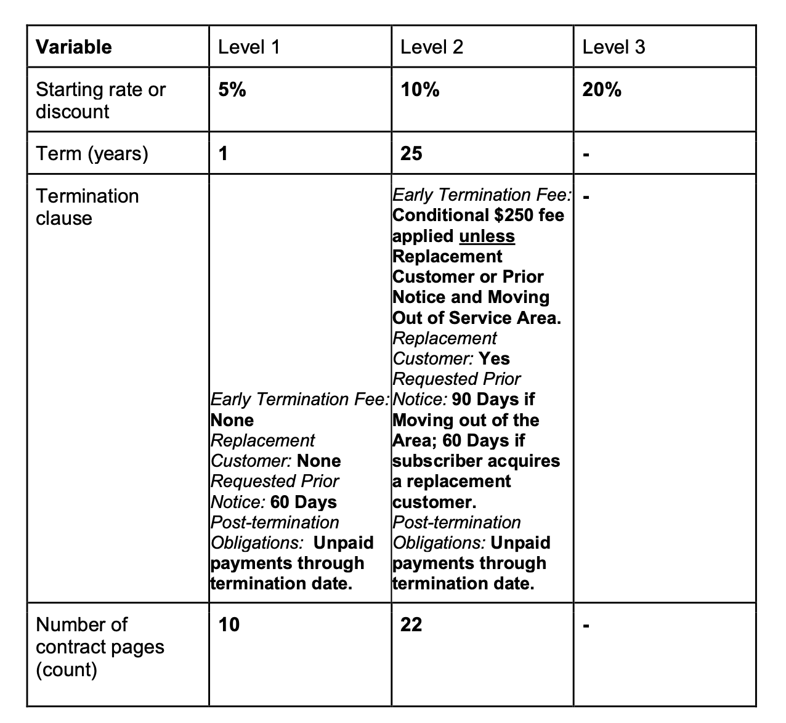

<style>

# Input Files
{
   display: none;
 }
</style>


```{r message=FALSE, warning=FALSE, include=FALSE}

#Load packages we'll need throughout the entire document
library(readxl)
library(sf)
library(dplyr)
library(janitor)
library(dplyr)
library(tidycensus)
library(tidyverse)
options(tigris_use_cache = TRUE)
library(nngeo)
library(plotly)
library(kableExtra)
library(haven)
library(rms)
library(rmdformats)
library(ggplot2)
library(plotly)


options(scipen = 100)


```

```{r message=FALSE, warning=FALSE, include=FALSE}

## Change the below to match your local drive ##

input_folder <- '/Volumes/GoogleDrive/Shared drives/*Solstice | Low Income Inclusion/Projects/2019-2022 DOE SETO Contract Innovations/DOE SETO Project Implementation/Project Management/SETO Data Analysis/'


setwd(input_folder)

getwd()
```


```{r message=FALSE, warning=FALSE, include=FALSE}

# 1. Community Solar Priorities

survey_name = paste(input_folder,"1. Community Solar Priorities/Qualtrics Survey/seto_survey/output/QUALTRICS_survey_data_all.xlsx", sep="")

survey <- read_excel(survey_name)

# 2. Developer & Financier

dev_input = paste(input_folder, "2. Developer and Financier/", sep="")

#dev_input ='/Volumes/GoogleDrive/Shared drives/*Solstice | Low Income Inclusion/Projects/2019-2022 DOE SETO Contract Innovations/DOE SETO Project Implementation/Project Management/Developer and Financier Survey/'


# 3. Churn & Default

cd_input = paste(input_folder, "3. Churn and Default/", sep="")


#cd_input = '/Volumes/GoogleDrive/Shared drives/*Solstice | Low Income Inclusion/Projects/2019-2022 DOE SETO Contract Innovations/DOE SETO Project Implementation/Project Management/Churn & Default Analysis'


```


# Introduction

This document contains a detailed description of the data analysis plan for Solstice Initiative’s research titled, “Product Innovation to Increase Low- to Moderate-Income Customers’ Adoption of Community Solar PV”.

This research will incorporate data from three distinct datasets: 

1. **Community Solar Priorities** research survey forms completed by respondents of varying demographics assessing the favorability of factorial test contracts and offering feedback on various aspects of the community solar product; 

2. **Developer and Financier Research** survey responses from developers and financiers to assess price sensitivities of language used in contract agreements; 

3. **Churn and Default Research** records of subscribers leaving programs and missing payments (“churn and default data”) provided by solar developers. 


# Community Solar Priorities 

## Research Questions

The primary research questions we are attempting to investigate are listed below:

1. How does contract attributes such as subscriber contract page length, savings rate, term length or cancellation fee attached to a subscriber agreement influence adoption rates for community shared solar?
2. How does contract adoption rate differ between contract variables across term categories?
3. How do varying demographics respond differently to contract variables included in community shared solar subscriber contracts?
4. Outside of customer contract priorities, what other preferences do individuals have for the design of community solar programs?

The primary outcome from the Community Solar Priorities research will be the contract adoption rate, measured at the point of the survey.The secondary outcome from the Community Solar Priorities research will be hypothesis- generating data collected on broad customer priorities related to community solar program design that can inform future research.

## Hypotheses

The following constitute the contract attribute hypotheses. Each is phrased as the null hypotheses. 

1. There is no significant difference in contract adoption between programs with a 9-page contract and 23-page contract.
2. There is no significant difference in contract adoption between programs with 5% savings, 10% savings, and 20% savings.
3. There is no significant difference in contract adoption between programs with and without a cancellation fee.
4. There is no significant difference in contract adoption between programs with a 1-year term length and those with a 25-year term length.
5. There is no significant difference in contract adoption across demographic characteristics, including race, income and homeownership status.


A number of independent variables will be used for both contract attributes and demographic data. Interaction variables will be tested for significant, along with a initial stepwise regression to determine which variables to initially include. The below equation is a summary of the full model used in this analysis. The dependent variable is a binary variable for contract adoption, $y_{signup}$, where 1 signifies the contract was adopted and 0 signifies it was not.  

\begin{equation}

y_{signup} = \beta_{0} + \beta_{1}x_{sr} +\beta_{2}x_{cly} +\beta_{3}x_{clp}  +\beta_{4}x_{cf} + \\  \beta{5}x_{inc}+\beta_{6}x_{race} + \beta{7}x_{hs} +\beta_{8}x_{fam} + \beta_{9}x_{rev} + \beta_{10}x_{ord}+ e_{i}

\end{equation}

where,


* $x_{sr}$: savings rates on monthly energy bill in contracts, listed at either 5%, 10% or 20%
* $x_{cly}$: contract length years, either 1 or 25 years
* $x_{clp}$: contract length pages, either 10 or 20 pages
* $x_{cf}$: cancellation fee, either zero or $250
* $x_{inc}$: income, listed as Low (up to 50% of AMI), Moderate (50% - 120% of AMI), or High (>120% AMI)
* $x_{race}$: Categories include Asian, Black or African American, Hispanic or Latino, White and Other POC
* $x_{hs}$: Homeowner status for Homeowner, Renter or Other
* $x_{fam}$: More or less familiar with community solar
* $x_{rev}$: How much respondent reviewed the contract; up to half the contract review is captured by "less review", over half and up to the whole contract is "more review"
* $x_{ord}$: Contract review order, likely not necessary.

Other variables of interest to consider: government program - x_govt


This research focuses on community shared solar (CSS) programs that are third-party owned and have participants subscribe to ongoing payments. Typically, within these programs, customers are given predefined, discrete contract terms rather than being able to compare multiple offerings or select their own terms. Our research is attempting to mimic this approach by giving customers a randomly assigned contract and surveying them on their willingness to adopt this program.




```{r echo=FALSE, message=FALSE, warning=FALSE}

##clean survey zip and race to match ACS categories

survey$zip <- str_pad(survey$zip, width=5, side="left", pad="0")


survey <- survey %>%
  mutate( Race2 = case_when(
    race_eth == "White" ~ race_eth,
    race_eth == "Black or African American" ~ race_eth,
    race_eth =="Hispanic or Latino" ~ race_eth,
    race_eth == "Asian" ~ race_eth,
    TRUE ~ "Other - POC"
  )) %>%
  mutate(zip_2 = as.integer(zip)) %>%
  mutate(state_2 = case_when(
    is.na(state) & startsWith(zip, '8') ~ "CO",
    is.na(state) & startsWith(zip, '6') ~ "IL",
    is.na(state) & startsWith(zip, '0') ~ "MA",
    is.na(state) & startsWith(zip, '2') ~ "MD",
    is.na(state) & startsWith(zip, '5') ~ "MN",
    is.na(state) & startsWith(zip, '1') ~ "NY",
    is.na(state) & startsWith(zip, '97') ~ "OR",
    is.na(state) & startsWith(zip, '9') ~ "CA",
    TRUE ~ state
  )) %>%
# drop two observations (one record) that don't have zip or state
  filter(!is.na(state_2))

survey$x_cf <- as.factor(survey$x_cf)
survey$x_sr <- factor(survey$x_sr, levels=c("5% savings rate", "10% savings rate", "20% savings rate"))


```


## Descriptive Statistics


```{r echo=FALSE, message=FALSE, warning=FALSE}
library(vtable)

labs <- data.frame(
    y_signup = "Sign Up",
    x_ord = 'Contract Review Order',
    x_sr = "Savings Rate",
    x_cf = "Cancellation Fee",
    x_clp = "Contract Length Pages",
    x_cly = "Contract Length Years",
    x_source = 'Source',
    x_rev = "Time Spent Reviewing Contracts",
    x_gov = "Government Assistance",
    x_race = "Race", 
    x_hs = "Homeownership",
    x_inc = "Income",
    x_fam = "Familiar with CS"
    )

vars <- c("y_signup","x_ord", "x_sr", "x_cf", "x_clp", "x_cly", "x_source", "x_rev",
          "x_gov", "x_race", "x_hs", "x_inc", "x_fam" )

st(survey, vars=vars, label=labs, col.breaks = 7)

```


### Demographic Comparison


```{r echo=FALSE, message=FALSE, warning=FALSE}

temp <- get_acs(
  geography="state", 
  state=c("CA", "CO", "IL", "MA", "MD", "MN", "NY", "OR"),
  variables=c("White" ="B03002_003",
              "Black or African American" = "B03002_004",
              "Native American or Alaskan Native" = "B03002_005",
              "Asian" = "B03002_006",
              "Native Hawaiian or Pacific Islander" = "B03002_007",
              "Other" = "B03002_008",
              "Multiracial" = "B03002_009",
              "Hispanic or Latino" = "B03002_012"),
  year=2020, 
  geometry=FALSE)


temp_state <- temp %>%
#  filter(NAME=="California") %>%
  select(Race=variable, Total = estimate) %>%
  mutate( Race2 = case_when(
    Race == "White" ~ Race,
    Race == "Black or African American" ~ Race,
    Race =="Hispanic or Latino" ~ Race,
    Race == "Asian" ~ Race,
    TRUE ~ "Other - POC"
  )) %>%
  group_by(Race2) %>%
  summarise(Total = sum(Total)) %>%
  arrange(Race2) %>%
  mutate(Proportion = Total/sum(Total)) 


survey_race <- survey %>%
  group_by(Race=Race2, .drop=FALSE) %>%
#  filter(state=="CA") %>%
  summarise(Total = n()/2) %>%
  mutate(Proportion = Total/sum(Total)) %>%
  arrange(Race)   


join_with_survey <- cbind(temp_state, survey_race)

join_with_survey <- join_with_survey[,-4]

temp_hold <- join_with_survey %>%
  select(Race=Race2, Census_Total = Total, Census_Proportion = Proportion, 
         Survey_Total = Total.1, Survey_Proportion = Proportion.1) 


race_total <- temp_hold %>%
  mutate(Deserves=Census_Total/(sum(Census_Total)/sum(Survey_Total))) %>%
  mutate(Proportion_Weight = Deserves/Survey_Total,
         Population_Weight = Census_Total/Survey_Total,
         Check_Proportion_Weight = Proportion_Weight * Survey_Total,
         Check_Population_Weight=Population_Weight * Survey_Total) %>%
    arrange(-Census_Total)%>%
    adorn_totals("row")


race_total$Population_Weight[race_total$Race=="Total"] <- sum(race_total$Survey_Total[1:5] * race_total$Population_Weight[1:5])

race_total_table <- race_total %>%
  select(Race, Census_Total,Survey_Total, Weight = Population_Weight ) %>%
  kbl(caption = "Descriptive Statistics, 8-State Region",
      digits = 3, format.args = list(big.mark = ",",scientific = FALSE)) %>%
  kable_classic(full_width = T, html_font = "Cambria") %>%
  kable_styling(bootstrap_options = c("striped", "hover", "condensed", "responsive")) 


race_total_table
```


```{r echo=FALSE, message=FALSE, warning=FALSE}

survey_race_graph <- race_total %>%
  select(Race, Census = Census_Proportion, Survey = Survey_Proportion) %>%
  filter(Race !="Total")


graph_temp <- reshape2::melt(survey_race_graph, id.var='Race') 


g <- ggplot(graph_temp, aes(x=reorder(Race, -value), y=value))+geom_bar(aes(fill=variable),stat='identity', position='dodge') +theme_classic()+
  xlab('') + ylab('Proportion') + labs(color='') +   ggtitle("SETO Survey State and Census Race Totals, 8-State Region")+
  theme(axis.text.x = element_text(angle = 45, vjust = 0.5, hjust=0.5))
ggplotly(g)


```


Sources: 

1. Government Programs: [Urban Institute](https://www.urban.org/sites/default/files/publication/99674/five_things_you_may_not_know_about_the_us_social_safety_net_1.pdf)
2. Race, Income, Homeownership


### Crosstab Graphics

#### Savings Rate & Income

```{r echo=FALSE, message=FALSE, warning=FALSE}
p <- ggplot(survey) +
  geom_bar(aes(x=x_sr, fill=y_signup),
           position = "dodge") +facet_wrap(~x_inc) + theme_minimal() + theme(axis.text.x = element_text(angle = 45, vjust = 0.5, hjust=0.5)) + xlab("")

ggplotly(p)
```

#### Savings Rate & Race

```{r echo=FALSE, message=FALSE, warning=FALSE}
p <- ggplot(survey) +
  geom_bar(aes(x=x_race, fill=y_signup),
           position = "dodge") +facet_wrap(~x_sr) + theme_minimal() + theme(axis.text.x = element_text(angle = 45, vjust = 0.5, hjust=0.5)) + xlab("")

ggplotly(p)
```

#### Race & Income


```{r echo=FALSE, message=FALSE, warning=FALSE}
p <- ggplot(survey) +
  geom_bar(aes(x=x_race, fill=y_signup),
           position = "dodge") +facet_wrap(~x_inc) + theme_minimal() + theme(axis.text.x = element_text(angle = 45, vjust = 0.5, hjust=0.5)) + xlab("")

ggplotly(p)
```


#### Cancellation Fee & Income


```{r echo=FALSE, message=FALSE, warning=FALSE}
p <- ggplot(survey) +
  geom_bar(aes(x=factor(x_cf), fill=y_signup),
           position = "dodge") +facet_wrap(~x_inc) + theme_minimal() + theme(axis.text.x = element_text(angle = 45, vjust = 0.5, hjust=0.5)) + xlab("")

ggplotly(p)
```


#### Cancellation Fee & Race

```{r echo=FALSE, message=FALSE, warning=FALSE}
p <- ggplot(survey) +
  geom_bar(aes(x=factor(x_cf), fill=y_signup),
           position = "dodge") +facet_wrap(~x_race) + theme_minimal() + theme(axis.text.x = element_text(angle = 45, vjust = 0.5, hjust=0.5)) + xlab("")

ggplotly(p)
```


#### Contract Years & Income


```{r echo=FALSE, message=FALSE, warning=FALSE}
p <- ggplot(survey) +
  geom_bar(aes(x=factor(x_cly), fill=y_signup),
           position = "dodge") +facet_wrap(~x_inc) + theme_minimal() + theme(axis.text.x = element_text(angle = 45, vjust = 0.5, hjust=0.5)) + xlab("")

ggplotly(p)
```


#### Contract Years & Race

```{r echo=FALSE, message=FALSE, warning=FALSE}
p <- ggplot(survey) +
  geom_bar(aes(x=factor(x_cly), fill=y_signup),
           position = "dodge") +facet_wrap(~x_race) + theme_minimal() + theme(axis.text.x = element_text(angle = 45, vjust = 0.5, hjust=0.5)) + xlab("")

ggplotly(p)
```


## Primary Analysis


 *to-do* 
 
 add intro/dialogue 
 
 
<style>
### Stepwise


{
   display: none;
 }
</style>


### Regression Tables


```{r message=FALSE, warning=FALSE, include=FALSE}


temp_data <- read_dta(paste(input_folder, "1. Community Solar Priorities/Qualtrics Survey/seto_survey/output/QUALTRICS_survey_data_all.dta", sep=""))

temp_data$x_sr <- as.factor(temp_data$x_sr)
temp_data$x_cly <- as.factor(temp_data$x_cly)
temp_data$x_clp <- as.factor(temp_data$x_clp)
temp_data$x_cf <- as.factor(temp_data$x_cf)
temp_data$x_inc <- as.factor(temp_data$x_inc)
temp_data$x_race <- as.factor(temp_data$x_race)
temp_data$x_hs <- as.factor(temp_data$x_hs)
temp_data$x_fam <- as.factor(temp_data$x_fam)
temp_data$x_gov <- as.factor(temp_data$x_gov)
temp_data$x_source <- as.factor(temp_data$x_source)

temp_data$x_rev <- as.factor(temp_data$x_rev)
temp_data$x_ord <- as.factor(temp_data$x_ord)


```


```{r message=FALSE, warning=FALSE, include=FALSE}
knitr::opts_chunk$set(echo = FALSE)
library(stargazer)


# drop third homestatus answer of other

model_data <- temp_data %>%
  mutate(x_hs_drop_other = case_when(
    x_hs==1 ~ 1,
    x_hs==2 ~ 2
  )) %>%
  dplyr::select(id, y_signup, x_sr, x_cly, x_clp, x_cf, x_inc, x_race, x_hs_drop_other, x_fam, x_rev, x_ord,x_gov, x_source, weight_income, weight_race)

model_data$x_hs_drop_other <- as.factor(model_data$x_hs_drop_other)


attr(model_data, "model.varnames") <- c("id", "Sign Up", "Savings Rate 10%", "Savings Rate 20%","Contract Length 25 Years", "Contract Length 20 Pages", "Cancellation Fee $250", "High Income", "Moderate Income", "Black", "Hispanic", "Asian", "Other", "Renter", "More Familiar", "More Reviewed", "weight income", "weight race" )

# 
model_data <- model_data %>%
  filter(!is.na(x_ord)) %>%
  filter(!is.na(x_hs_drop_other))

names(attributes(model_data))
attr(model_data, "model.varnames")

model_data$x_inc <- relevel(model_data$x_inc, ref='3')
```


```{r message=FALSE, warning=FALSE}

##load all models that we'll analyze

cols <- c("x_sr", "x_cly", "x_clp", "x_cf", "x_inc", "x_race", "x_hs_drop_other", "x_fam" , "x_rev")

model_data[cols] <- lapply(model_data[cols], as.factor)

model_data$x_inc <- relevel(model_data$x_inc, ref='3')

mod1=lrm(y_signup ~ x_sr  , x=T, y=T, weight=weight_race, data=model_data, normwt=T)
mod1 = robcov(mod1, cluster=model_data$id)

mod2=lrm(y_signup ~ x_sr + x_cly+x_clp  , x=T, y=T, weight=weight_race, data=model_data, normwt=T)
mod2 = robcov(mod2, cluster=model_data$id)

mod3=lrm(y_signup ~ x_sr + x_cly+x_clp+x_cf   , x=T, y=T, weight=weight_race, data=model_data, normwt=T)
mod3 = robcov(mod3, cluster=model_data$id)

mod4=lrm(y_signup ~ x_sr  + x_cly+x_clp+x_cf + x_inc , x=T, y=T, weight=weight_race, data=model_data, normwt=T)
mod4 = robcov(mod4, cluster=model_data$id)

mod5=lrm(y_signup ~ x_sr  + x_cly+x_clp+x_cf + x_inc + x_race   , x=TRUE, y=TRUE, weight=weight_race, data=model_data, normwt=T)
mod5 = robcov(mod5, cluster=model_data$id)

mod6=lrm(y_signup ~ x_sr  + x_cly+x_clp+x_cf + x_inc + x_race + x_hs_drop_other , x=T, y=T, weight=weight_race, data=model_data, normwt=T)
mod6 = robcov(mod6, cluster=model_data$id)

mod7=lrm(y_signup ~ x_sr  + x_cly+x_clp+x_cf + x_inc + x_race + x_hs_drop_other + x_fam , x=T, y=T, weight=weight_race, data=model_data, normwt=T)
mod7 = robcov(mod7, cluster=model_data$id)

mod8=lrm(y_signup ~ x_sr  + x_cly+x_clp+x_cf + x_inc + x_race + x_hs_drop_other + x_fam +x_rev , x=T, y=T, weight=weight_race, data=model_data, normwt=T)
mod8 = robcov(mod8, cluster=model_data$id)


```


#### Table 1

```{r echo=FALSE, message=FALSE, warning=FALSE}

## first four models

stargazer(mod1, mod2, mod3, mod4, type="text", align=TRUE,
          title="Regression Table 1",
           covariate.labels = attr(model_data, "model.varnames")[3:9], 
          dep.var.labels = attr(model_data, "model.varnames")[2])
```


#### Table 2


```{r message=FALSE, warning=FALSE}

stargazer(mod5, mod6, mod7, mod8, type="text", align=TRUE,
          title="Regression Table 2",
          covariate.labels = attr(model_data, "model.varnames")[3:16], 
          dep.var.labels = attr(model_data, "model.varnames")[2])
```

### Odds Ratios


#### Table 1


```{r message=FALSE, warning=FALSE}
stargazer(mod1, mod2, mod3, mod4, type="text", align=TRUE,
        covariate.labels = attr(model_data, "model.varnames")[3:9], 
        dep.var.labels = attr(model_data, "model.varnames")[2],
        apply.coef = exp,
        apply.se = exp,
        title = "Odds Ratio, Table 1")


```


#### Table 2


```{r message=FALSE, warning=FALSE}
stargazer(mod5, mod6, mod7, mod8, type="text", align=TRUE,
          covariate.labels = attr(model_data, "model.varnames")[3:16], 
          dep.var.labels = attr(model_data, "model.varnames")[2],
          apply.coef = exp,
          apply.se = exp,
          title = "Odds Ratio, Table 2")


```


### Discussion


**Main Takeaways**

1. Table 1
 + Contract length of 25 years compared to 1 year remained a significant deterrent to contract acceptance rates.
 + Relative to low income, moderate and higher income respondents were more likely to accept the contract, holding th effect of savings rate, cancellation fee, and contract length constant. 
2. Table 2
 + Contract lenght remained a constant deterrance 
 + Homeowner status, rent vs homeowner, was not observed as a statistically significant effect on signup rate. Likely some multicollinearity due to effect (sign) varying from model 2 to model 4. 
 + After including familiarity and reviewed dummies, savings rate becomes statistically significant effect on likelihood of contract adoption. 
 + More familiar with community solar implies significantly more likely to adopt contract (suggests importance of education) - odds ratio of >4 in model 3 and 4
 + In looking at contract adoption by race, Hispanics were the only group observed with a statistically significant effect in models 1 and 2. Relative to white, hispanic rates were higher. This effect is negated after additional IVs are introduces in models 3 and 4. 


From Table 1, four models are presented analyzing changes in probability of sign up. Controlling for all other variables, contract length and income were found to have statistically significant effects on the rate of sign up. Contract length was found to have a strong negative impact on probability of contract adoption. For example, holding all variables constant, from model 2 we see that the odds ratio for contract length of 25 years is 0.782, meaning the group with contracts of 25 years are 0.782 times as likely as the group with contracts of 1 year of signing up, or a 21.8% decrease in odds of signing up. 

Interestingly, lower income respondents were much less likely to adopt the contract, even when controlling for savings rate, contract length and number of pages, and cancellation fees. High income and medium income respondents were 1.3 and 1.7 times the odds to adopt the contract compared to low income respondents, controlling for contract attributes.  


## Secondary Analysis

The secondary analysis will include an ordered logit model to investigate the degree of which the same independent variables above influence the likert scale questions asked in the survey. Ordered logit models are commonly utilized with outputs of interest are categorized in discrete sequences, such as a Likert scale. 


### Would/Would Not Sign Up

#### Savings Rate

Tables 1-4 in output/regressions


### Agree/Disagree


# Developer & Financier

Developer and Financier Research: survey responses from developers and financiers to assess price sensitivities of language used in contract agreements


Due to the exploratory nature of this research, Solstice intends to leave analyses associated with the developer and financier component of this research unstructured in part. As a result of the expected small sample size, described in more detail below, we do not expect to be able to test for significance between observations. Rather, this analysis will be conducted through a detailed analysis of primary data collected via survey responses. Absence of existing published data detailing limiting factors and decision points related to constructing community solar  subscriber agreements makes it difficult to establish a baseline in order to conduct hypotheses-generated analyses as outlined in previous sections. This research takes a grounded theory approach to construct theory through primary data collection and subsequent comparative
analysis. 

## Research Questions


Average program terms

1. What is the average savings rate offered by developers and financiers within their community solar programs?
2. Do savings rates offered by different community solar developers and financiers?
3. What are average term length offered by developers and financiers within their community solar programs?
4. Do cancellation clauses offered by developers and financiers within their community solar programs?
5. What is the average subscriber contract page length offered by developers and financiers within their community solar programs?

Further,

1. Do economic/financing factors influence developers and financiers to structure community solar subscriber contracts?
2. Under what conditions are developers willing to adjust their programmatic terms to include LMI populations in their programs?


The primary outcome of this research will be collecting and analyzing average terms used by solar developers and financiers in existing community solar contracts. The secondary outcome of the survey responses from developers and financiers will be measured by variables suggested to influence and limit offerings for existing community solar products.


## Processing and Cleaning

There were 254 unique responses. 

```{r message=FALSE, warning=FALSE, include=FALSE}

devd_raw <- read.csv(paste(dev_input, "Data/Developer and Financier Survey_July 20, 2022_06.45.csv", sep=""))


#remove first two rows of data + only include finished responses

devd <- devd_raw[-1:-2,] %>%
  filter(Finished=="True") %>%
  mutate(Latitude = round(as.double(LocationLatitude),2),
         Longitude = round(as.double(LocationLongitude),2))

devd <- st_as_sf(devd,coords = c("Longitude", "Latitude"))

# Labels for Factor variables 
savings_levels <- c("0-5% savings per month", "6-10% savings per month", "11-15% savings per month",
  "16-20% savings per month", "21-50% savings per month")

term_levels <- c("No minimum length", "1-3 years", "4-6 years",
  "7-10 years", "11-15 years", "16-20 years", "20 or more years")

cancel_levels <- c("No cancellation fee", "$1-$100", "$101-$250", "$251-$500",
                   "$501-$1,000", "More than $1,000")

differ_levels <- c("Yes", "No", "Unsure")

# factor(sizes, levels = c("small", "medium", "large"))
# 
# 
# devd$savings_rate <- factor(devd$Q11,

dev_sum <- devd %>%
  st_drop_geometry() %>%
  mutate(
      #Savings Rates
      savings_rate = Q11,
      savings_rate_differ = Q12,
      savings_rate_lmi_differ = case_when(
        Q13 == "Higher savings" ~ Q13,
        Q13 == "Lower savings" ~ Q13),
      
      #Term Length
      term_length = Q14,
      term_length_differ = Q15,
      term_length_lmi_differ = case_when(
        Q16 == "Longer terms" ~ Q16,
        Q16 == "Shorter terms" ~ Q16),
      
      #Cancellation Fee
      cancel_fee = Q17,
      cancel_fee_differ = Q18,
      cancel_fee_lmi_differ = case_when(
        Q19 == "Higher cancellation fees" ~ Q19,
        Q19 == "Lower cancellation fees" ~ Q19),  
      
      #Perceived default rate for market
      default_market = Q27_1,
      default_lmi = Q27_2,
      
      #Perceived churn rate for market
      churn_market = Q27_1.1,
      churn_lmi = Q27_2.1,
      
    ) %>%
  
  # Drop NA values and other erroneous entries
  filter(savings_rate %in% savings_levels) %>%
  filter(term_length %in% term_levels) %>%
  filter(cancel_fee %in% cancel_levels) %>%
  
  #Apply factor levels
  mutate(savings_rate = factor(savings_rate, levels=savings_levels),
         savings_rate_differ = factor(savings_rate_differ, levels=differ_levels),
         
         term_length = factor(term_length, levels=term_levels),
         term_length_differ = factor(term_length_differ, levels=differ_levels),
         
         cancel_fee = factor(cancel_fee, levels=cancel_levels),
         cancel_fee_differ = factor(cancel_fee_differ, levels=differ_levels))

```

## Descriptive Statistics


### Savings Rates


```{r message=FALSE, warning=FALSE, include=FALSE}
sr_data <- dev_sum %>%
  mutate(
    sr = case_when(
      savings_rate=="0-5% savings per month" | savings_rate=="6-10% savings per month"  ~ 1,
      savings_rate=="11-15% savings per month" ~ 2,
      savings_rate=="16-20% savings per month" ~ 3,
      savings_rate=="21-50% savings per month" ~ 4,
      TRUE ~ 0
    )
  ) %>%
  mutate(new_sr_differ = case_when(
    savings_rate_differ=="Yes" ~ 1,
    savings_rate_differ=="No" ~ 0,
  )) %>%
  mutate(sr_one = case_when(
    sr == 1 ~ 1, 
    TRUE ~ 0
  ),
  sr_two = case_when(
    sr == 2 ~ 1, 
    TRUE ~ 0
  ),
  sr_three = case_when(
    sr == 3 ~ 1, 
    TRUE ~ 0
  ),
  sr_four = case_when(
    sr == 4 ~ 1, 
    TRUE ~ 0
  ))

sr_data$sr <- factor(sr_data$sr)

mylogit <- glm(new_sr_differ ~ sr, data = sr_data, family = "binomial")
summary(mylogit)


```


```{r echo=FALSE, message=FALSE, warning=FALSE,fig.cap = "An amazing plot"}
library(scales)

temp_data <- dev_sum %>%
  group_by(savings_rate) %>%
  summarise(total = n()) %>%
  mutate(percent_total = percent(total/sum(total)))

p<-ggplot(data=temp_data, aes(x=savings_rate, y=total))+
  geom_bar(stat = 'identity', aes(text=paste0(
    "Total: ", total,
    "<br>",
    "Percent: ", percent_total
  ))) + theme_minimal() + 
  theme(axis.text.x = element_text(angle = 45, vjust = 0.5, hjust=0.5)) +
  xlab("")+ ggtitle("Average Savings Rate for Community Solar")

ggplotly(p, tooltip="text")


## save out 

p <- ggplot(data=temp_data, aes(x=savings_rate, y=total))+
  geom_bar(stat = 'identity', aes(text=paste0(
    "Total: ", total,
    "<br>",
    "Percent: ", percent_total
  ))) + theme_minimal() + 
  theme(axis.text.x = element_text(angle = 45, vjust = 0.5, hjust=0.5)) +
  xlab("")+ ggtitle("Average Savings Rate for Community Solar") +
    geom_text(aes(label=total), position=position_dodge(width=0.9), vjust=-0.25)

p
```

34.4% of respondents marked savings rate from 0-10%; 33% recorded 11-15%, and 32.5% answered 16-50%. Hence, nearly two-thirds of respondents recorded over 10% for savings rate for community solar. 


```{r echo=FALSE, message=FALSE, warning=FALSE}

temp_data <- dev_sum %>%
  group_by(savings_rate_differ) %>%
  summarise(total = n()) %>%
  mutate(percent_total = percent(total/sum(total)))

p<-ggplot(data=temp_data, aes(x=savings_rate_differ, y=total))+
  geom_bar(stat = 'identity', aes(text=paste0(
    "Total: ", total,
    "<br>",
    "Percent: ", percent_total
  ))) + theme_minimal() + 
  theme(axis.text.x = element_text(angle = 45, vjust = 0.5, hjust=0.5)) +
  xlab("") + ggtitle("Does Savings Rate Differ for LMI Customers")

ggplotly(p, tooltip="text")


```


```{r echo=FALSE, message=FALSE, warning=FALSE}

temp_data <- dev_sum %>%
  filter(!is.na(savings_rate_lmi_differ)) %>%
  group_by(savings_rate_lmi_differ) %>%
  summarise(total = n()) %>%
  mutate(percent_total = percent(total/sum(total)))

p<-ggplot(data=temp_data, aes(x=savings_rate_lmi_differ, y=total))+
  geom_bar(stat = 'identity', aes(text=paste0(
    "Total: ", total,
    "<br>",
    "Percent: ", percent_total
  ))) + theme_minimal() + 
  theme(axis.text.x = element_text(angle = 45, vjust = 0.5, hjust=0.5)) +
  xlab("") + ggtitle("If Yes, how do savings rate differ for LMI Customers compared to market rates?")

ggplotly(p, tooltip="text")


```


### Term Length

```{r echo=FALSE, message=FALSE, warning=FALSE}


temp_data <- dev_sum %>%
  group_by(term_length) %>%
  summarise(total = n()) %>%
  mutate(percent_total = percent(total/sum(total)))

p<-ggplot(data=temp_data, aes(x=term_length, y=total))+
  geom_bar(stat = 'identity', aes(text=paste0(
    "Total: ", total,
    "<br>",
    "Percent: ", percent_total
  ))) + theme_minimal() + 
  theme(axis.text.x = element_text(angle = 45, vjust = 0.5, hjust=0.5)) +
  xlab("")+ ggtitle("Average Term Length for Community Solar")

ggplotly(p, tooltip="text")


```


```{r echo=FALSE, message=FALSE, warning=FALSE}


temp_data <- dev_sum %>%
  filter(!is.na(term_length_differ)) %>%
  group_by(term_length_differ) %>%
  summarise(total = n()) %>%
  mutate(percent_total = percent(total/sum(total)))

p<-ggplot(data=temp_data, aes(x=term_length_differ, y=total))+
  geom_bar(stat = 'identity', aes(text=paste0(
    "Total: ", total,
    "<br>",
    "Percent: ", percent_total
  ))) + theme_minimal() + 
  theme(axis.text.x = element_text(angle = 45, vjust = 0.5, hjust=0.5)) +
  xlab("") + ggtitle("Does Savings Rate Differ for LMI Customers")

ggplotly(p, tooltip="text")


```


```{r echo=FALSE, message=FALSE, warning=FALSE}
temp_data <- dev_sum %>%
  filter(!is.na(term_length_lmi_differ)) %>%
  group_by(term_length_lmi_differ) %>%
  summarise(total = n()) %>%
  mutate(percent_total = percent(total/sum(total)))

p<-ggplot(data=temp_data, aes(x=term_length_lmi_differ, y=total))+
  geom_bar(stat = 'identity', aes(text=paste0(
    "Total: ", total,
    "<br>",
    "Percent: ", percent_total
  ))) + theme_minimal() + 
  theme(axis.text.x = element_text(angle = 45, vjust = 0.5, hjust=0.5)) +
  xlab("") + ggtitle("If Yes, how do term rates differ for LMI Customers compared to market rates?")

ggplotly(p, tooltip="text")


```


### Cancellation Fee


```{r echo=FALSE, message=FALSE, warning=FALSE}


temp_data <- dev_sum %>%
  filter(!is.na(cancel_fee)) %>%
  group_by(cancel_fee) %>%
  summarise(total = n()) %>%
  mutate(percent_total = percent(total/sum(total)))

p<-ggplot(data=temp_data, aes(x=cancel_fee, y=total))+
  geom_bar(stat = 'identity', aes(text=paste0(
    "Total: ", total,
    "<br>",
    "Percent: ", percent_total
  ))) + theme_minimal() + 
  theme(axis.text.x = element_text(angle = 45, vjust = 0.5, hjust=0.5)) +
  xlab("")+ ggtitle("Average cancellation fee for Community Solar")

ggplotly(p, tooltip="text")


```


```{r echo=FALSE, message=FALSE, warning=FALSE}

temp_data <- dev_sum %>%
  filter(!is.na(cancel_fee_differ)) %>%
  group_by(cancel_fee_differ) %>%
  summarise(total = n()) %>%
  mutate(percent_total = percent(total/sum(total)))

p<-ggplot(data=temp_data, aes(x=cancel_fee_differ, y=total))+
  geom_bar(stat = 'identity', aes(text=paste0(
    "Total: ", total,
    "<br>",
    "Percent: ", percent_total
  ))) + theme_minimal() + 
  theme(axis.text.x = element_text(angle = 45, vjust = 0.5, hjust=0.5)) +
  xlab("") + ggtitle("Does cancellation fee Differ for LMI Customers")

ggplotly(p, tooltip="text")


```


```{r echo=FALSE, message=FALSE, warning=FALSE}
temp_data <- dev_sum %>%
  filter(!is.na(cancel_fee_lmi_differ)) %>%
  group_by(cancel_fee_lmi_differ) %>%
  summarise(total = n()) %>%
  mutate(percent_total = percent(total/sum(total)))

p<-ggplot(data=temp_data, aes(x=cancel_fee_lmi_differ, y=total))+
  geom_bar(stat = 'identity', aes(text=paste0(
    "Total: ", total,
    "<br>",
    "Percent: ", percent_total
  ))) + theme_minimal() + 
  theme(axis.text.x = element_text(angle = 45, vjust = 0.5, hjust=0.5)) +
  xlab("") + ggtitle("If Yes, how do cancellation fees differ for LMI customers compared to market rates?")

ggplotly(p, tooltip="text")


```

### Factors: Ability to make CS accessibility to LMI {.tabset}


```{r message=FALSE, warning=FALSE, include=FALSE}

importance_levels <- c("Not at all important", "Slightly important", "Moderately important", "Very important", "Extremely important")

temp_data <- devd %>%
  st_drop_geometry() %>%
  mutate(
    Q21_1 = factor(Q21_1, levels=importance_levels),
    Q21_2 = factor(Q21_2, levels=importance_levels),
    Q21_3 = factor(Q21_3, levels=importance_levels),
    Q21_4 = factor(Q21_4, levels=importance_levels),
    Q21_5 = factor(Q21_5, levels=importance_levels),
    Q21_6 = factor(Q21_6, levels=importance_levels),
    Q21_7 = factor(Q21_7, levels=importance_levels),
    Q21_8 = factor(Q21_8, levels=importance_levels)
  ) 

temp_data_1 <- temp_data %>%
  group_by(Q21_1) %>%
  filter(Q21_1 != "") %>%
  summarise(Q21_1=n()) %>%
  mutate(Importance = importance_levels) %>%
  select(Importance, Q21_1) 


temp_data_2 <- temp_data %>%
  group_by(Q21_2) %>%
  filter(Q21_2 != "") %>%
  summarise(Q21_2=n()) %>%
  mutate(Importance = importance_levels) %>%
  select(Importance,Q21_2) 

temp_data_3 <- temp_data %>%
  group_by(Q21_3) %>%
  filter(Q21_3 != "") %>%
  summarise(Q21_3=n()) %>%
  mutate(Importance = importance_levels) %>%
  select(Importance,Q21_3) 

temp_data_4 <- temp_data %>%
  group_by(Q21_4) %>%
  filter(Q21_4 != "") %>%
  summarise(Q21_4=n()) %>%
  mutate(Importance = importance_levels) %>%
  select(Importance,Q21_4) 

temp_data_5 <- temp_data %>%
  group_by(Q21_5) %>%
  filter(Q21_5 != "") %>%
  summarise(Q21_5=n()) %>%
  mutate(Importance = importance_levels) %>%
  select(Importance,Q21_5) 

temp_data_6 <- temp_data %>%
  group_by(Q21_6) %>%
  filter(Q21_6 != "") %>%
  summarise(Q21_6=n()) %>%
  mutate(Importance = importance_levels) %>%
  select(Importance,Q21_6) 


final_data <- cbind(temp_data_1, temp_data_2,temp_data_3,temp_data_4,temp_data_5,temp_data_6)


final_data$order <- c(1,2,3,4,5)


```


#### CAC

```{r echo=FALSE, message=FALSE, warning=FALSE}

#Q21_1

fig <- plot_ly(temp_data_1, labels = ~Importance, values = ~Q21_1, type = 'pie', sort=F)
fig <- fig %>% layout(title = 'High customer acquisition costs',
         xaxis = list(showgrid = FALSE, zeroline = FALSE, showticklabels = FALSE),
         yaxis = list(showgrid = FALSE, zeroline = FALSE, showticklabels = FALSE))

fig
```


#### Churn
```{r echo=FALSE, message=FALSE, warning=FALSE}
#Q21_2

fig <- plot_ly(temp_data_2, labels = ~Importance, values = ~Q21_2, type = 'pie', sort=F)
fig <- fig %>% layout(title = 'Risk of subscriber churn',
         xaxis = list(showgrid = FALSE, zeroline = FALSE, showticklabels = FALSE),
         yaxis = list(showgrid = FALSE, zeroline = FALSE, showticklabels = FALSE))

fig
```

#### Default
```{r echo=FALSE, message=FALSE, warning=FALSE}


#Q21_3

fig <- plot_ly(temp_data_3, labels = ~Importance, values = ~Q21_3, type = 'pie', sort=F)
fig <- fig %>% layout(title = 'Risk of subscriber default',
         xaxis = list(showgrid = FALSE, zeroline = FALSE, showticklabels = FALSE),
         yaxis = list(showgrid = FALSE, zeroline = FALSE, showticklabels = FALSE))

fig
```


#### Communication
```{r echo=FALSE, message=FALSE, warning=FALSE}

#Q21_4

fig <- plot_ly(temp_data_4, labels = ~Importance, values = ~Q21_4, type = 'pie', sort=F)
fig <- fig %>% layout(title = 'Difficult to communicate community solar product',
         xaxis = list(showgrid = FALSE, zeroline = FALSE, showticklabels = FALSE),
         yaxis = list(showgrid = FALSE, zeroline = FALSE, showticklabels = FALSE))

fig
```


#### LMI ID
```{r echo=FALSE, message=FALSE, warning=FALSE}

#Q21_5

fig <- plot_ly(temp_data_5, labels = ~Importance, values = ~Q21_5, type = 'pie', sort=F)
fig <- fig %>% layout(title = 'Difficulty qualifying households as LMI',
         xaxis = list(showgrid = FALSE, zeroline = FALSE, showticklabels = FALSE),
         yaxis = list(showgrid = FALSE, zeroline = FALSE, showticklabels = FALSE))

fig
```


#### Financing
```{r echo=FALSE, message=FALSE, warning=FALSE}

#Q21_6

fig <- plot_ly(temp_data_6, labels = ~Importance, values = ~Q21_6, type = 'pie', sort=F)
fig <- fig %>% layout(title = 'Lack of available project financing',
         xaxis = list(showgrid = FALSE, zeroline = FALSE, showticklabels = FALSE),
         yaxis = list(showgrid = FALSE, zeroline = FALSE, showticklabels = FALSE))

fig

```


### {-}


```{r eval=FALSE, message=FALSE, warning=FALSE, include=FALSE}
agg_data <- final_data[,c(1,2,4,6,8,10,12)] %>%
  mutate(new_cat = case_when(
    Importance == "Not at all important" | Importance == "Slightly important" ~ "No",
    Importance =="Moderately important" ~ "Maybe", 
    TRUE ~ "Yes"
  )) 


agg <- melt(agg_data, id="new_cat") %>%
  filter(variable!="Importance") %>%
  mutate(value = as.integer(value)) %>%
  group_by(variable) %>%
  summarise(
    No = sum(value[new_cat=="No"]),
    Maybe = sum(value[new_cat=="Maybe"]),
    Yes = sum(value[new_cat=="Yes"]),

    total=sum(value)

  )

agg
```

#### Takeaways

1. Customer aqcuisition costs (CAC) was the strongest factor, with 55.5% responding as either very or extremely important. 

2. Defaults were relatively less important, nearly a quarter (23.6%) responding that it was either not at all or slightly important. When compared to threat of churn, respondents shifted from slightly to moderately important, implying that churn is more of a concern compared to default. 


#### Bar Charts


```{r echo=FALSE, message=FALSE, warning=FALSE}
library(reshape)

stacked_data <- melt(final_data, id='Importance') %>%
  filter(variable!="order") %>%
  mutate(order = case_when(
    Importance=="Not at all important" ~ 1,
    Importance=="Slightly important" ~ 2, 
    Importance=="Moderately important" ~ 3, 
    Importance=="Very important" ~ 4, 
    Importance=="Extremely important" ~ 5
  )) %>%
  mutate( Factors = case_when(
    variable=="Q21_1" ~ "High customer acquisition costs",
    variable=="Q21_2" ~ "Risk of subscriber churn",
    variable=="Q21_3" ~ "Risk of subscriber default",
    variable=="Q21_4" ~ "Difficulty communicating CS",
    variable=="Q21_5" ~ "difficulty qualifying LMI HHs",
    variable=="Q21_6" ~ "Lack of project financing",
    
  )
    
  )


b <- ggplot(data = stacked_data, aes(x = reorder(Importance, -order), y = value, fill = Factors,
                                     text=paste("Factor", Factors, "\nValue:", value))) + 
       geom_bar(stat = 'identity', position = 'dodge') + coord_flip() + xlab("") + ylab("")+ theme_minimal()

ggplotly(b, tooltip="text")

```


### Factors: Influence decision to include LMI in projects {.tabset}

```{r message=FALSE, warning=FALSE, include=FALSE}

importance_levels <- c("Not at all important", "Slightly important", "Moderately important", "Very important", "Extremely important")

temp_data <- devd %>%
  st_drop_geometry() %>%
  mutate(
    Q24_1 = factor(Q24_1, levels=importance_levels),
    Q24_2 = factor(Q24_2, levels=importance_levels),
    Q24_3 = factor(Q24_3, levels=importance_levels),
    Q24_4 = factor(Q24_4, levels=importance_levels),
    Q24_5 = factor(Q24_5, levels=importance_levels)
  ) 

temp_data_1 <- temp_data %>%
  group_by(Q24_1) %>%
  filter(Q24_1 != "") %>%
  summarise(Q24_1=n()) %>%
  mutate(Importance = importance_levels) %>%
  select(Importance, Q24_1) 


temp_data_2 <- temp_data %>%
  group_by(Q24_2) %>%
  filter(Q24_2 != "") %>%
  summarise(Q24_2=n()) %>%
  mutate(Importance = importance_levels) %>%
  select(Importance,Q24_2) 

temp_data_3 <- temp_data %>%
  group_by(Q24_3) %>%
  filter(Q24_3 != "") %>%
  summarise(Q24_3=n()) %>%
  mutate(Importance = importance_levels) %>%
  select(Importance,Q24_3) 

temp_data_4 <- temp_data %>%
  group_by(Q24_4) %>%
  filter(Q24_4 != "") %>%
  summarise(Q24_4=n()) %>%
  mutate(Importance = importance_levels) %>%
  select(Importance,Q24_4) 

temp_data_5 <- temp_data %>%
  group_by(Q24_5) %>%
  filter(Q24_5 != "") %>%
  summarise(Q24_5=n()) %>%
  mutate(Importance = importance_levels) %>%
  select(Importance,Q24_5) 


final_data <- cbind(temp_data_1, temp_data_2,temp_data_3,temp_data_4,temp_data_5)


final_data$order <- c(1,2,3,4,5)


```


#### Policy

```{r echo=FALSE, message=FALSE, warning=FALSE}

temp_data_1$Importance = factor(temp_data_1$Importance, levels=importance_levels)

#Q24_1

fig <- plot_ly(temp_data_1, labels = ~Importance, values = ~Q24_1, type = 'pie', sort=F)
fig <- fig %>% layout(title = 'Policy/Program Requirements',
         xaxis = list(showgrid = FALSE, zeroline = FALSE, showticklabels = FALSE),
         yaxis = list(showgrid = FALSE, zeroline = FALSE, showticklabels = FALSE))

fig


```


#### Community Interest
```{r echo=FALSE, message=FALSE, warning=FALSE}
#Q24_2

fig <- plot_ly(temp_data_2, labels = ~Importance, values = ~Q24_2, type = 'pie', sort=F)
fig <- fig %>% layout(title = 'Community Interest',
         xaxis = list(showgrid = FALSE, zeroline = FALSE, showticklabels = FALSE),
         yaxis = list(showgrid = FALSE, zeroline = FALSE, showticklabels = FALSE))

fig


```

#### Financier Interest
```{r echo=FALSE, message=FALSE, warning=FALSE}


#Q24_3

fig <- plot_ly(temp_data_3, labels = ~Importance, values = ~Q24_3, type = 'pie', sort=F)
fig <- fig %>% layout(title = 'Financier/Investor Interest',
         xaxis = list(showgrid = FALSE, zeroline = FALSE, showticklabels = FALSE),
         yaxis = list(showgrid = FALSE, zeroline = FALSE, showticklabels = FALSE))

fig


```


#### Company Interest
```{r echo=FALSE, message=FALSE, warning=FALSE}

#Q24_4

fig <- plot_ly(temp_data_4, labels = ~Importance, values = ~Q24_4, type = 'pie', sort=F)
fig <- fig %>% layout(title = 'Company Interest',
         xaxis = list(showgrid = FALSE, zeroline = FALSE, showticklabels = FALSE),
         yaxis = list(showgrid = FALSE, zeroline = FALSE, showticklabels = FALSE))

fig


```


#### Equity
```{r echo=FALSE, message=FALSE, warning=FALSE}

#Q24_5

fig <- plot_ly(temp_data_5, labels = ~Importance, values = ~Q24_5, type = 'pie', sort=F)
fig <- fig %>% layout(title = 'Equity and Inclusion',
         xaxis = list(showgrid = FALSE, zeroline = FALSE, showticklabels = FALSE),
         yaxis = list(showgrid = FALSE, zeroline = FALSE, showticklabels = FALSE))

fig
```


### {-}

```{r message=FALSE, warning=FALSE, include=FALSE}
agg_data <- final_data[,c(1,2,4,6,8,10)] %>%
  mutate(new_cat = case_when(
    Importance == "Not at all important" | Importance == "Slightly important" ~ "No",
    Importance =="Moderately important" ~ "Maybe", 
    TRUE ~ "Yes"
  )) 


agg <- melt(agg_data, id="new_cat") %>%
  filter(variable!="Importance") %>%
  mutate(value = as.integer(value)) %>%
  group_by(variable) %>%
  summarise(
    No = sum(value[new_cat=="No"]),
    Maybe = sum(value[new_cat=="Maybe"]),
    Yes = sum(value[new_cat=="Yes"]),

    total=sum(value)

  )

agg
```

#### Takeaways

1. For factors influencing the decision to include LMI households in CS projects, the most common answer was policy requirements and equity/inclusion efforts, with 63% and 58% or respondents marking these as very or extremely important, respectively. 

2. Community interest exhibited a large degree of moderate importance, with 44.7% of respondents, whereas only 43% respondents marked it as either very or extremely important, the smallest proportion exhibited in each of the five questions. 

#### Bar Charts


```{r echo=FALSE, message=FALSE, warning=FALSE}
stacked_data <- melt(final_data, id='Importance') %>%
  filter(variable!="order") %>%
  mutate(order = case_when(
    Importance=="Not at all important" ~ 1,
    Importance=="Slightly important" ~ 2, 
    Importance=="Moderately important" ~ 3, 
    Importance=="Very important" ~ 4, 
    Importance=="Extremely important" ~ 5
  )) %>%
  mutate( Factors = case_when(
    variable=="Q24_1" ~ "Policy/program requirements",
    variable=="Q24_2" ~ "Community interest",
    variable=="Q24_3" ~ "Financier/investor interest",
    variable=="Q24_4" ~ "My company's interest",
    variable=="Q24_5" ~ "Equity and inclusion"
    
  )
    
  ) %>%
  filter(!is.na(Factors))


b <- ggplot(data = stacked_data, aes(x = reorder(Importance, -order), y = value, fill = Factors,
                                     text=paste("Factor", Factors, "\nValue:", value))) + 
       geom_bar(stat = 'identity', position = 'dodge') + coord_flip() + xlab("") + ylab("")+ theme_minimal()

ggplotly(b, tooltip="text")

```


### Factors: Fill out CS Projects Quickly {.tabset}

```{r message=FALSE, warning=FALSE, include=FALSE}

importance_levels <- c("Definitely not", "Probably not", "Might or might not", "Probably yes", "Definitely yes")

temp_data <- devd %>%
  st_drop_geometry() %>%
  mutate(
    Q26_1 = factor(Q26_1, levels=importance_levels),
    Q26_2 = factor(Q26_2, levels=importance_levels),
    Q26_3 = factor(Q26_3, levels=importance_levels),
    Q26_4 = factor(Q26_4, levels=importance_levels),
    Q26_5 = factor(Q26_5, levels=importance_levels),
    Q26_6 = factor(Q26_6, levels=importance_levels),
    Q26_7 = factor(Q26_7, levels=importance_levels)
  ) 

temp_data_1 <- temp_data %>%
  group_by(Q26_1) %>%
  filter(Q26_1 != "") %>%
  summarise(Q26_1=n()) %>%
  mutate(Importance = importance_levels) %>%
  select(Importance, Q26_1) 


temp_data_2 <- temp_data %>%
  filter(Q26_2 != "") %>%
  group_by(Q26_2, .drop=FALSE) %>%
  summarise(Q26_2=n()) %>%
  mutate(Importance = importance_levels) %>%
  select(Importance,Q26_2) 

temp_data_3 <- temp_data %>%
  group_by(Q26_3) %>%
  filter(Q26_3 != "") %>%
  summarise(Q26_3=n()) %>%
  mutate(Importance = importance_levels) %>%
  select(Importance,Q26_3) 

temp_data_4 <- temp_data %>%
  group_by(Q26_4) %>%
  filter(Q26_4 != "") %>%
  summarise(Q26_4=n()) %>%
  mutate(Importance = importance_levels) %>%
  select(Importance,Q26_4) 

temp_data_5 <- temp_data %>%
  group_by(Q26_5) %>%
  filter(Q26_5 != "") %>%
  summarise(Q26_5=n()) %>%
  mutate(Importance = importance_levels) %>%
  select(Importance,Q26_5) 

temp_data_6 <- temp_data %>%
  group_by(Q26_6) %>%
  filter(Q26_6 != "") %>%
  summarise(Q26_6=n()) %>%
  mutate(Importance = importance_levels) %>%
  select(Importance,Q26_6) 


temp_data_7 <- temp_data %>%
  group_by(Q26_7) %>%
  filter(Q26_7 != "") %>%
  summarise(Q26_7=n()) %>%
  mutate(Importance = importance_levels) %>%
  select(Importance,Q26_7) 


final_data <- cbind(temp_data_1, temp_data_2,temp_data_3,temp_data_4,temp_data_5,temp_data_6,temp_data_7)


final_data$order <- c(1,2,3,4,5)


```


```{r message=FALSE, warning=FALSE, include=FALSE}
agg_data <- final_data[,c(1,2,4,6,8,10,12,14)] %>%
  mutate(new_cat = case_when(
    Importance == "Definitely not" | Importance == "Probably not" ~ "No",
    Importance =="Might or might not" ~ "Maybe", 
    TRUE ~ "Yes"
  )) 


agg <- melt(agg_data, id="new_cat") %>%
  filter(variable!="Importance") %>%
  mutate(value = as.integer(value)) %>%
  group_by(variable) %>%
  summarise(
    No = sum(value[new_cat=="No"]),
    Maybe = sum(value[new_cat=="Maybe"]),
    Yes = sum(value[new_cat=="Yes"]),

    total=sum(value)

  )

agg
```


#### Savings rate

```{r echo=FALSE, message=FALSE, warning=FALSE}

temp_data_1$Importance = factor(temp_data_1$Importance, levels=importance_levels)

#Q26_1

fig <- plot_ly(temp_data_1, labels = ~Importance, values = ~Q26_1, type = 'pie', sort=F)
fig <- fig %>% layout(title = 'Savings rate',
         xaxis = list(showgrid = FALSE, zeroline = FALSE, showticklabels = FALSE),
         yaxis = list(showgrid = FALSE, zeroline = FALSE, showticklabels = FALSE))

fig


```


#### Term length
```{r echo=FALSE, message=FALSE, warning=FALSE}
#Q26_2

fig <- plot_ly(temp_data_2, labels = ~Importance, values = ~Q26_2, type = 'pie', sort=F)
fig <- fig %>% layout(title = 'Contract term length',
         xaxis = list(showgrid = FALSE, zeroline = FALSE, showticklabels = FALSE),
         yaxis = list(showgrid = FALSE, zeroline = FALSE, showticklabels = FALSE))

fig

```

#### Cancel fee
```{r echo=FALSE, message=FALSE, warning=FALSE}
#Q26_3

fig <- plot_ly(temp_data_3, labels = ~Importance, values = ~Q26_3, type = 'pie', sort=F)
fig <- fig %>% layout(title = 'Cancellation fees',
         xaxis = list(showgrid = FALSE, zeroline = FALSE, showticklabels = FALSE),
         yaxis = list(showgrid = FALSE, zeroline = FALSE, showticklabels = FALSE))

fig

```


#### No On-bill credit
```{r echo=FALSE, message=FALSE, warning=FALSE}

#Q26_4

fig <- plot_ly(temp_data_4, labels = ~Importance, values = ~Q26_4, type = 'pie', sort=F)
fig <- fig %>% layout(title = 'Lack of on-bill crediting',
         xaxis = list(showgrid = FALSE, zeroline = FALSE, showticklabels = FALSE),
         yaxis = list(showgrid = FALSE, zeroline = FALSE, showticklabels = FALSE))

fig

```


#### On-bill credit
```{r echo=FALSE, message=FALSE, warning=FALSE}

#Q26_5

fig <- plot_ly(temp_data_5, labels = ~Importance, values = ~Q26_5, type = 'pie', sort=F)
fig <- fig %>% layout(title = 'Presence of on-bill crediting',
         xaxis = list(showgrid = FALSE, zeroline = FALSE, showticklabels = FALSE),
         yaxis = list(showgrid = FALSE, zeroline = FALSE, showticklabels = FALSE))

fig

```

#### Contract complex
```{r echo=FALSE, message=FALSE, warning=FALSE}

#Q26_6

fig <- plot_ly(temp_data_6, labels = ~Importance, values = ~Q26_6, type = 'pie', sort=F)
fig <- fig %>% layout(title = 'Contract complexity/length',
         xaxis = list(showgrid = FALSE, zeroline = FALSE, showticklabels = FALSE),
         yaxis = list(showgrid = FALSE, zeroline = FALSE, showticklabels = FALSE))

fig


```


#### Trust
```{r echo=FALSE, message=FALSE, warning=FALSE}


#Q26_7

fig <- plot_ly(temp_data_7, labels = ~Importance, values = ~Q26_7, type = 'pie', sort=F)
fig <- fig %>% layout(title = 'Trust of developers or project owners',
         xaxis = list(showgrid = FALSE, zeroline = FALSE, showticklabels = FALSE),
         yaxis = list(showgrid = FALSE, zeroline = FALSE, showticklabels = FALSE))

fig

```


### {-}


#### Takeaways

1. presence of on-bill credit for community solar projects exhibited the strongest positive response, with 58% of respondents recording it as probably or definitely impacted speed of CS projects being completed. 
2. Conversely, though marginally different, contract complexity and trust were the least powerful, with 17.6% and 19% of respondents, respectively, stating it either probably not or definitely did not have an effect on projects being quickly filled out.   


#### Bar Charts


```{r echo=FALSE, message=FALSE, warning=FALSE}
stacked_data <- melt(final_data, id='Importance') %>%
  filter(variable!="order") %>%
  mutate(order = case_when(
    Importance=="Definitely not" ~ 1,
    Importance=="Probably not" ~ 2, 
    Importance=="Might or might not" ~ 3, 
    Importance=="Probably yes" ~ 4, 
    Importance=="Definitely yes" ~ 5
  )) %>%
  mutate( Factors = case_when(
    variable=="Q26_1" ~ "Savings rate",
    variable=="Q26_2" ~ "Contract term length",
    variable=="Q26_3" ~ "Termination fees",
    variable=="Q26_4" ~ "Lack of on-bill crediting",
    variable=="Q26_5" ~ "Presence of on-bill crediting",
    variable=="Q26_6" ~ "Contract complexity/length",
    variable=="Q26_7" ~ "Trust of developers or project owners"    
  )
    
  ) %>%
  filter(!is.na(Factors))


b <- ggplot(data = stacked_data, aes(x = reorder(Importance, -order), y = value, fill = Factors,
                                     text=paste("Factor", Factors, "\nValue:", value))) + 
       geom_bar(stat = 'identity', position = 'dodge') + coord_flip() + xlab("") + ylab("")+ theme_minimal()

ggplotly(b, tooltip="text")

```


### Savings Rate for Market and LMI


```{r message=FALSE, warning=FALSE, include=FALSE}

default_levels <- c("0-2%", "3-5%", "6-8%", "9-11%")
churn_levels <-  c("0-4%", "5-10%", "11-15%", "16-20%")

temp_data <- dev_sum %>%
  mutate(
    default_market = factor(default_market, levels=default_levels),
    default_lmi = factor(default_lmi, levels=default_levels),
  ) 

temp_dev <- dev_sum %>%
  filter(default_market != "Unsure") %>%
  group_by(default_market) %>%
  summarise(default_market=n()) %>%
  mutate(Importance = default_levels,
         pct_market = default_market/sum(default_market)) %>%
  select(Importance, default_market) 


temp_lmi <- dev_sum %>%
  filter(default_lmi != "Unsure") %>%
  filter(default_lmi !="") %>%
  group_by(default_lmi) %>%
  summarise(default_lmi=n()) %>%
  mutate(Importance = default_levels,
         pct_lmi = default_lmi/sum(default_lmi)) %>%
  select(default_lmi) 


final_data <- cbind(temp_dev, temp_lmi)


final_data$order <- c(1,2,3,4)


```


```{r echo=FALSE, message=FALSE, warning=FALSE}
stacked_data <- melt(final_data, id='Importance') %>%
  filter(variable!="order") %>%
  mutate(order = case_when(
    Importance=="0-2%" ~ 1,
    Importance=="3-5%" ~ 2, 
    Importance=="6-8%" ~ 3, 
    Importance=="9-11%" ~ 4
  )) %>%
  mutate( Factors =  variable) %>%
  filter(!is.na(Factors))


b <- ggplot(data = stacked_data, aes(x = reorder(Importance, -order), y = value, fill = Factors,
                                     text=paste("Factor", Factors, "\nValue:", value))) + 
       geom_bar(stat = 'identity', position = 'dodge') + coord_flip() + xlab("") + ylab("")+ theme_minimal() +
      ggtitle("Guess the default rate you experience for the two groups:")

ggplotly(b, tooltip="text")

```


### Churn Rate for Market and LMI

```{r message=FALSE, warning=FALSE, include=FALSE}

default_levels <- c("0-2%", "3-5%", "6-8%", "9-11%")
churn_levels <-  c("0-4%", "5-10%", "11-15%", "16-20%")

temp_data <- dev_sum %>%
  mutate(
    churn_market = factor(churn_market, levels=churn_levels),
    churn_lmi = factor(churn_lmi, levels=churn_levels),
  ) 

temp_dev <- temp_data %>%
  filter(churn_market != "Unsure") %>%
  group_by(churn_market) %>%
  summarise(churn_market=n()) %>%
  mutate(Importance = churn_levels) %>%
  select(Importance, churn_market) 


temp_lmi <- temp_data %>%
  filter(churn_lmi != "Unsure") %>%
  group_by(churn_lmi) %>%
  summarise(churn_lmi=n()) %>%
  mutate(Importance = churn_levels) %>%
  select( churn_lmi) 


final_data <- cbind(temp_dev, temp_lmi)


final_data$order <- c(1,2,3,4)


```


```{r echo=FALSE, message=FALSE, warning=FALSE}
stacked_data <- melt(final_data, id='Importance') %>%
  filter(variable!="order") %>%
  mutate(order = case_when(
    Importance=="0-4%" ~ 1,
    Importance=="5-10%" ~ 2, 
    Importance=="11-15%" ~ 3, 
    Importance=="16-20%" ~ 4
  )) %>%
  mutate( Factors =  variable) %>%
  filter(!is.na(Factors))


b <- ggplot(data = stacked_data, aes(x = reorder(Importance, -order), y = value, fill = Factors,
                                     text=paste("Factor", Factors, "\nValue:", value))) + 
       geom_bar(stat = 'identity', position = 'dodge') + coord_flip() + xlab("") + ylab("")+ theme_minimal() +
      ggtitle("Guess the churn rate you experience for the two groups:")

ggplotly(b, tooltip="text")

```
### Project stage by highest churn/default

COD = commerical operational date (?)


```{r message=FALSE, warning=FALSE, include=FALSE}

time_levels <- c("Prior to COD", "Within first year of operation", "Within 1-3 years", "Within 3-5 years", "After 5 years")


temp_data <- dev_sum %>%
  mutate(
    churn_time = factor(Q30_1, levels=time_levels),
    default_time = factor(Q30_2, levels=time_levels),
  ) 

temp_churn <- temp_data %>%
  filter(churn_time !="") %>%
  group_by(churn_time) %>%
  summarise(churn_time=n()) %>%
  mutate(Importance = time_levels) %>%
  select(Importance, churn_time) 


temp_default <- temp_data %>%
  filter(default_time !="") %>%
  group_by(default_time) %>%
  summarise(default_time=n()) %>%
  mutate(Importance = time_levels) %>%
  select( default_time) 


final_data <- cbind(temp_churn, temp_default)


final_data$order <- c(1,2,3,4,5)


```


```{r echo=FALSE, message=FALSE, warning=FALSE}
stacked_data <- melt(final_data, id='Importance') %>%
  filter(variable!="order") %>%
  mutate(order = case_when(
    Importance=="Prior to COD" ~ 1,
    Importance=="Within first year of operation" ~ 2, 
    Importance=="Within 1-3 years" ~ 3, 
    Importance=="Within 3-5 years" ~ 4,
    Importance=="After 5 years" ~ 5
  )) %>%
  mutate( Factors =  variable) %>%
  filter(!is.na(Factors))


b <- ggplot(data = stacked_data, aes(x = reorder(Importance, -order), y = value, fill = Factors,
                                     text=paste("Factor", Factors, "\nValue:", value))) + 
       geom_bar(stat = 'identity', position = 'dodge') + coord_flip() + xlab("") + ylab("")+ theme_minimal() +
      ggtitle("Project Phase where highest rates observed:")

ggplotly(b, tooltip="text")

```


## Loan Loss Reserve 


### Alleviate Risk

```{r echo=FALSE, message=FALSE, warning=FALSE}

risk_levels <- c("Moderately unlikely","Slightly unlikely" , "Neither likely nor unlikely", "Moderately likely", "Slightly likely", "Extremely likely")


temp_data <- dev_sum %>%
  mutate(
    loan_loss_risk = factor(Q33_1, levels=risk_levels),
  ) %>%
  filter(!is.na(loan_loss_risk)) %>%
  group_by(loan_loss_risk) %>%
  summarise(total = n()) %>%
  mutate(percent_total = percent(total/sum(total)))

p<-ggplot(data=temp_data, aes(x=loan_loss_risk, y=total))+
  geom_bar(stat = 'identity', aes(text=paste0(
    "Total: ", total,
    "<br>",
    "Percent: ", percent_total
  ))) + theme_minimal() + 
  theme(axis.text.x = element_text(angle = 45, vjust = 0.5, hjust=0.5)) +
  xlab("")+ ggtitle("Average cancellation fee for Community Solar")

ggplotly(p, tooltip="text")


```


### Ideal Loan Loss Reserve


```{r echo=FALSE, message=FALSE, warning=FALSE}


temp_data <- dev_sum %>%
  mutate(
    loan_loss_rev = as.integer(Q34_1),
  ) %>%
  filter(!is.na(loan_loss_rev)) 


p<-ggplot(data=temp_data, aes(x=loan_loss_rev)) +
  #geom_line(stat="count") + 
  geom_histogram(binwidth=10) +
  theme_minimal() + theme(axis.text.x = element_text(angle = 45, vjust = 0.5, hjust=0.5)) +
  xlab("% Revenue Covered")+ ggtitle("percentage of total project revenue for ideal loan loss reserve (10% bin)")
ggplotly(p)


```


Summary statistics for loan loan reserve, percentage of total project revenue:

```{r echo=FALSE, message=FALSE, warning=FALSE}
summary(temp_data$loan_loss_rev, na.rm=T)
```


```{r echo=FALSE, message=FALSE, warning=FALSE}


#Removed values of ideal loss reserve revenue protection of 2018 anad 50000

temp_data <- dev_sum %>%
  mutate(
    loan_loss_rev = as.integer(Q35_1),
  ) %>%
  filter(!is.na(loan_loss_rev)) %>%
  filter(loan_loss_rev < 2000)


p<-ggplot(data=temp_data, aes(x=loan_loss_rev)) +
  # geom_line(stat="count") +
  geom_histogram(binwidth=10) + 
  theme_minimal() + theme(axis.text.x = element_text(angle = 45, vjust = 0.5, hjust=0.5)) +
  xlab("Years")+ ggtitle("Ideal number of years loan loss reserve would cover (10 year bin)")
ggplotly(p)


```


Summary statistics for loan loan reserve, percentage of total years covered:

```{r echo=FALSE, message=FALSE, warning=FALSE}
summary(temp_data$loan_loss_rev, na.rm=T)
```

## Respondent Map

Coordinates have been obfuscated to protect location. 


```{r echo=FALSE, message=FALSE, warning=FALSE}
library(leaflet)

library(tidycensus)


leaflet() %>%
  addProviderTiles("CartoDB.Positron") %>%
#  addTiles() %>%
  addCircleMarkers(data=devd,
             radius=8)


```


# Churn & Default


## Research Questions

## Hypotheses

## Descriptive Statistics

## Primary Analysis

**note**

*Analysis is awaiting Experian appending.* 


This analysis summaries the Nautilus customer data from the Frog Hollow and Howell community solar farm participation from January 2020 to April 2022. The goal of the analysis is to first describe the characteristics of the residents, the prevalence of default and/or churn rates, the prevalence of churn rates, and any statistically significant differences between groups in their default, late payments or churn rates.  


The data is comprised of monthly payment performance and, where available, demographic data for residents. 32,385 monthly observations over 813 homes, 812 accounts and 621 users were initially observed. To avoid data quality issues and to analyze any potential churn and default trends, for Frog Hollow households the analysis will drop values in October 2021 until April 2022. This narrowed dataset is comprised of 31,704 observations; the homes, accounts and users did not change.  


cd_input = '/Volumes/GoogleDrive/Shared drives/*Solstice | Low Income Inclusion/Projects/2019-2022 DOE SETO Contract Innovations/DOE SETO Project Implementation/Project Management/Churn & Default Analysis'


```{r message=FALSE, warning=FALSE, include=FALSE}

raw <- read_excel(paste(input_folder, "3. Churn and Default/Central Hudson Preliminary Analysis/Nautilus Raw Data.xlsx", sep=""), 
    sheet = "platform billing data")


raw$default_tag[raw$default_tag=="none"] <- 0


total_obs = nrow(raw)

total_users = length(unique(raw$user_id))

total_accounts = length(unique(raw$utility_acct_number))

total_hh = length(unique(raw$property_id))

temp_hold = raw

raw <- raw %>%
  #filter particular case that was entered in error
  filter(user_id!=8377) %>%
  # make tag for frog hollow properties after 9/2021; assuming the entries for april 2022 are legit, this drops October 2021 values 
  mutate(FH_bill_issuetag = case_when(
         solar_farm_name=="Frog Hollow (CHGE)" & year == 2021 & month > 9 ~ 1,
         TRUE ~ 0),
         
         Churn_Tag = case_when(
           default_tag !=0 & default_tag !="Defaulted Payment" ~ 1,
           TRUE ~ 0
         )) %>%
  filter(FH_bill_issuetag !=1) %>%
  mutate(
    log_solar = case_when(
      kwh_allocated>0 ~ log(kwh_allocated),
      TRUE ~ 0
    )
  )

```


```{r message=FALSE, warning=FALSE, include=FALSE}

## total observations/i.e. monthly performance data over ALL accounts/households/users

total_obs = nrow(raw)

total_users = length(unique(raw$user_id))

total_accounts = length(unique(raw$utility_acct_number))

total_hh = length(unique(raw$property_id))

```


```{r message=FALSE, warning=FALSE, include=FALSE}


flipped <- raw %>%
  group_by(utility_acct_number) %>%
  summarise(
            tenure = length(unique(date_concat)),
            default = sum(default_tag=="Defaulted Payment"),
            HH_Income = unique(`HH Income`),
            payment_method = unique(payment_type),
            temp_solar = max(kwh_allocated/1229),
            Churn_Tag = max(Churn_Tag)) %>%
            # Proj_Frog_Hollow_dummy = sum(solar_farm_name=="Frog Hollow (CHGE)"),
            # Proj_Howell_dummy = sum(solar_farm_name=="Howell (O&R)")) %>%
  mutate(defaulted = case_when(
    default>0 ~ 1,
    TRUE ~ 0
  ), count_user_id = n(),
  Income = case_when(
    HH_Income==">=$50,000" ~ "High",
    HH_Income=="$0-$49,999" ~ "Low"
  )) %>%
dplyr::select(-default, -HH_Income)


## filter out the duplicates


dupes <- flipped %>%
  filter(count_user_id == 2)

no_dupes <- flipped %>%
  filter(count_user_id==1)

```


```{r message=FALSE, warning=FALSE, include=FALSE}


## clean up dupes 

dupes <- dupes %>%
  group_by(utility_acct_number) %>%
  summarise(n=n())

dupes$tenure <- NA
dupes$Income <- NA
dupes$payment_method <- NA
dupes$temp_solar <- NA
dupes$solar_farm <- NA
dupes$churn_reason <- NA


## i think this method will just take the first? may need to through and manually check or find another system

for (i in (1:length(dupes$utility_acct_number)))
{
  #dupes$tenure[i] <- (flipped$tenure[flipped$utility_acct_number==dupes$utility_acct_number[i]])
  dupes$tenure[i] <- length(unique(raw$date_concat[raw$utility_acct_number==dupes$utility_acct_number[i]]))

  dupes$Income[i] <- (flipped$Income[flipped$utility_acct_number==dupes$utility_acct_number[i]])
  dupes$payment_method[i] <- (flipped$payment_method[flipped$utility_acct_number==dupes$utility_acct_number[i]])
  dupes$temp_solar[i] <- (flipped$temp_solar[flipped$utility_acct_number==dupes$utility_acct_number[i]])
  dupes$solar_farm[i] <- raw$solar_farm_name[raw$utility_acct_number==dupes$utility_acct_number[i]]
  dupes$churn_reason[i] <- raw$default_tag[raw$utility_acct_number==dupes$utility_acct_number[i]]
  
}


no_dupes$solar_farm <- NA
no_dupes$churn_reason <- NA


for (i in (1:length(no_dupes$utility_acct_number)))
{
  
  no_dupes$solar_farm[i]<- raw$solar_farm_name[raw$utility_acct_number==no_dupes$utility_acct_number[i]]
  no_dupes$churn_reason[i] <- raw$default_tag[raw$utility_acct_number==no_dupes$utility_acct_number[i]]
  
}

```


```{r echo=FALSE, message=FALSE, warning=FALSE}
## join back with the main data

joined <- rbind(no_dupes, dupes) %>%
  dplyr::select(-n, -count_user_id)
  
```


The first ten rows of the data are presented, grouped by account number. Unique identifiers were replaced with sequential IDs. 

* Tenure: length in months each account was active 
* Payment_Method: either card or ACH/direct debit method
* temp_solar: annual (right?) solar allocation in kWh 
* Churn_Tag: binary _var_iable capturing if an account left the solar farm
* defauted: binary variable capturing if account holder defaulted on payment
* Income: Low (<$50,000) or High (>$50,000)
* Solar_Farm: Either Howell or Frog Hollow


```{r echo=FALSE, message=FALSE, warning=FALSE}

##remove account ID and replace with dummy sequence
joined$Account_ID <- seq(1,nrow(joined),1)

temp <- joined[,-1]

temp <- temp %>%
  relocate(Account_ID)


head(temp, 10) %>%
  kbl(caption = "First 10 Home Rows",  digits=2) %>%
  kable_classic(full_width = T, html_font = "Cambria")
```

  


## Descriptive Statistics

### Total


The summary statistics below provide additional information. The average tenure of the 812 accounts was 20.3 months. The churn rate was 12.4%. The sample does skew towards high income homes, however note a large number of missing values were observed in income (567, 70%). 


```{r echo=FALSE, message=FALSE, warning=FALSE}
library(tidyverse)

tenure <- joined %>%
  mutate(Name = "Tenure") %>%
  group_by(Name) %>%
  summarise(
    Total = sum(tenure),
    Mean = mean(tenure),
    Max = max(tenure),
    Min = min(tenure)
    
  )

defaults <- joined %>%
  mutate(Name = "Defaults") %>%
  group_by(Name) %>%
  summarise(
    Total = sum(defaulted, na.rm=T),
    Mean = mean(defaulted, na.rm=T),
    Max = max(defaulted, na.rm=T),
    Min = min(defaulted, na.rm=T)
    
  )

churn <- joined %>%
  mutate(Name = "Churn") %>%
  group_by(Name) %>%
  summarise(
    Total = sum(Churn_Tag, na.rm=T),
    Mean = mean(Churn_Tag, na.rm=T),
    Max = max(Churn_Tag, na.rm=T),
    Min = min(Churn_Tag, na.rm=T)
    
  )


low <- joined %>%
  mutate(Name = "Low Income") %>%
  group_by(Name) %>%
  summarise(
    Total = sum(Income=="Low", na.rm=T),
    Mean = mean(Income=="Low", na.rm=T),
    Max = NA,
    Min = NA
    
  )

high <- joined %>%
  mutate(Name = "High Income") %>%
  group_by(Name) %>%
  summarise(
    Total = sum(Income=="High", na.rm=T),
    Mean = mean(Income=="High", na.rm=T),
    Max = NA,
    Min = NA
    
  )

solar <- joined %>%
  mutate(Name = "Solar") %>%
  group_by(Name) %>%
  summarise(
    Total = sum(temp_solar, na.rm=T),
    Mean = mean(temp_solar, na.rm=T),
    Max =  max(temp_solar, na.rm=T),
    Min =  min(temp_solar, na.rm=T)
    
  )

payment_card <- joined %>%
  mutate(Name = "Payment by Card") %>%
  group_by(Name) %>%
  summarise(
    Total = sum(payment_method=="card", na.rm=T),
    Mean = mean(payment_method=="card", na.rm=T),
    Max =  NA,
    Min =  NA
    
  )

payment_ach <- joined %>%
  mutate(Name = "Payment by ACH") %>%
  group_by(Name) %>%
  summarise(
    Total = sum(payment_method=="ach", na.rm=T),
    Mean = mean(payment_method=="ach", na.rm=T),
    Max =  NA,
    Min =  NA
    
  )


summary_stats <- rbind(tenure,defaults,churn, low, high, solar, payment_card, payment_ach)


summary_stats %>%
  remove_rownames() %>%
  column_to_rownames(var = 'Name') %>%
  kbl(caption="Descriptive Statistics",  digits=2) %>%
  kable_classic(full_width = T, html_font = "Cambria")


```

### Frog Hollow


```{r echo=FALSE, message=FALSE, warning=FALSE}
library(tidyverse)

temp <- joined %>%
  filter(solar_farm == "Frog Hollow (CHGE)")

tenure <- temp %>%
  mutate(Name = "Tenure") %>%
  group_by(Name) %>%
  summarise(
    Total = sum(tenure),
    Mean = mean(tenure),
    Max = max(tenure),
    Min = min(tenure)
    
  )

defaults <- temp %>%
  mutate(Name = "Defaults") %>%
  group_by(Name) %>%
  summarise(
    Total = sum(defaulted, na.rm=T),
    Mean = mean(defaulted, na.rm=T),
    Max = max(defaulted, na.rm=T),
    Min = min(defaulted, na.rm=T)
    
  )

churn <- temp %>%
  mutate(Name = "Churn") %>%
  group_by(Name) %>%
  summarise(
    Total = sum(Churn_Tag, na.rm=T),
    Mean = mean(Churn_Tag, na.rm=T),
    Max = max(Churn_Tag, na.rm=T),
    Min = min(Churn_Tag, na.rm=T)
    
  )


low <- temp %>%
  mutate(Name = "Low Income") %>%
  group_by(Name) %>%
  summarise(
    Total = sum(Income=="Low", na.rm=T),
    Mean = mean(Income=="Low", na.rm=T),
    Max = NA,
    Min = NA
    
  )

high <- temp %>%
  mutate(Name = "High Income") %>%
  group_by(Name) %>%
  summarise(
    Total = sum(Income=="High", na.rm=T),
    Mean = mean(Income=="High", na.rm=T),
    Max = NA,
    Min = NA
    
  )

solar <- temp %>%
  mutate(Name = "Solar") %>%
  group_by(Name) %>%
  summarise(
    Total = sum(temp_solar, na.rm=T),
    Mean = mean(temp_solar, na.rm=T),
    Max =  max(temp_solar, na.rm=T),
    Min =  min(temp_solar, na.rm=T)
    
  )

payment_card <- temp %>%
  mutate(Name = "Payment by Card") %>%
  group_by(Name) %>%
  summarise(
    Total = sum(payment_method=="card", na.rm=T),
    Mean = mean(payment_method=="card", na.rm=T),
    Max =  NA,
    Min =  NA
    
  )

payment_ach <- temp %>%
  mutate(Name = "Payment by ACH") %>%
  group_by(Name) %>%
  summarise(
    Total = sum(payment_method=="ach", na.rm=T),
    Mean = mean(payment_method=="ach", na.rm=T),
    Max =  NA,
    Min =  NA
    
  )


summary_stats <- rbind(tenure,defaults,churn, low, high, solar, payment_card, payment_ach)


summary_stats %>%
  remove_rownames() %>%
  column_to_rownames(var = 'Name') %>%
  kbl(caption="Frog Hollow Descriptive Statistics",  digits=2) %>%
  kable_classic(full_width = T, html_font = "Cambria")


```

### Howell


```{r echo=FALSE, message=FALSE, warning=FALSE}
library(tidyverse)

temp <- joined %>%
  filter(solar_farm == "Howell (O&R)")

tenure <- temp %>%
  mutate(Name = "Tenure") %>%
  group_by(Name) %>%
  summarise(
    Total = sum(tenure),
    Mean = mean(tenure),
    Max = max(tenure),
    Min = min(tenure)
    
  )

defaults <- temp %>%
  mutate(Name = "Defaults") %>%
  group_by(Name) %>%
  summarise(
    Total = sum(defaulted, na.rm=T),
    Mean = mean(defaulted, na.rm=T),
    Max = max(defaulted, na.rm=T),
    Min = min(defaulted, na.rm=T)
    
  )

churn <- temp %>%
  mutate(Name = "Churn") %>%
  group_by(Name) %>%
  summarise(
    Total = sum(Churn_Tag, na.rm=T),
    Mean = mean(Churn_Tag, na.rm=T),
    Max = max(Churn_Tag, na.rm=T),
    Min = min(Churn_Tag, na.rm=T)
    
  )


low <- temp %>%
  mutate(Name = "Low Income") %>%
  group_by(Name) %>%
  summarise(
    Total = sum(Income=="Low", na.rm=T),
    Mean = mean(Income=="Low", na.rm=T),
    Max = NA,
    Min = NA
    
  )

high <- temp %>%
  mutate(Name = "High Income") %>%
  group_by(Name) %>%
  summarise(
    Total = sum(Income=="High", na.rm=T),
    Mean = mean(Income=="High", na.rm=T),
    Max = NA,
    Min = NA
    
  )

solar <- temp %>%
  mutate(Name = "Solar") %>%
  group_by(Name) %>%
  summarise(
    Total = sum(temp_solar, na.rm=T),
    Mean = mean(temp_solar, na.rm=T),
    Max =  max(temp_solar, na.rm=T),
    Min =  min(temp_solar, na.rm=T)
    
  )

payment_card <- temp %>%
  mutate(Name = "Payment by Card") %>%
  group_by(Name) %>%
  summarise(
    Total = sum(payment_method=="card", na.rm=T),
    Mean = mean(payment_method=="card", na.rm=T),
    Max =  NA,
    Min =  NA
    
  )

payment_ach <- temp %>%
  mutate(Name = "Payment by ACH") %>%
  group_by(Name) %>%
  summarise(
    Total = sum(payment_method=="ach", na.rm=T),
    Mean = mean(payment_method=="ach", na.rm=T),
    Max =  NA,
    Min =  NA
    
  )


summary_stats <- rbind(tenure,defaults,churn, low, high, solar, payment_card, payment_ach)


summary_stats %>%
  remove_rownames() %>%
  column_to_rownames(var = 'Name') %>%
  kbl(caption="Howell Descriptive Statistics",  digits=2) %>%
  kable_classic(full_width = T, html_font = "Cambria")


```


```{r message=FALSE, warning=FALSE, include=FALSE}

# Percentage of homes with any Default

any_defaults = sum(joined$defaulted, na.rm=T)/nrow(joined)

any_defaults 

any_churn = sum(joined$Churn_Tag>0, na.rm=T)/nrow(joined)


any_churn 
```

### Tenure Length


Obersvations are next grouped by tenure length. 


```{r echo=FALSE, message=FALSE, warning=FALSE}

tenures <- joined %>%
  mutate( tenure_length = case_when(
    tenure < 6 ~ "≤ 5",
    tenure > 5 & tenure < 11 ~ "5 to 10",
    tenure > 10 & tenure < 15 ~ "10 to 15",
    tenure >= 15~ "15 to 20",
    
  )) %>%
    group_by(tenure_length) %>%
    summarise(`Number of homes` = n(),
            `Churned` = sum(Churn_Tag, na.rm=T),
            `Defaulted` = sum(defaulted, na.rm=T),
            `Average Solar Allocation` = mean(temp_solar, na.rm=T),
            `Payment by Card` = sum(payment_method=="card", na.rm=T),
            `Payment by ACH` = sum(payment_method=="ach", na.rm=T)

            ) %>%
  mutate(
    temp_tag = case_when(
      tenure_length == "≤ 5" ~ 1,
      tenure_length == "5 to 10" ~ 2,
      tenure_length == "10 to 15" ~ 3,
      tenure_length == "15 to 20" ~ 4
    )
  ) %>%
  arrange(temp_tag) %>%
  dplyr::select(-temp_tag) %>%
  adorn_totals('row') 
    


tenures$`Average Solar Allocation`[tenures$tenure_length=="Total"] <- mean(joined$temp_solar,na.rm = T)

tenures %>%
 remove_rownames() %>%
  column_to_rownames(var = 'tenure_length') %>%
  kbl(caption="Account Tenure Length Statistics",  digits=2, format = "html", table.attr = "style='width:30%;'") %>%
  kableExtra::kable_styling() %>%
  kable_classic(full_width = F, html_font = "Cambria")


```


For homes that churned, the tenure was reasonbly much shorter than those that did not churn. The below graph shows the average tenure between these two groups, showing that it is almost double for those homes that exhibit continuous subscription. 

```{r echo=FALSE, message=FALSE, warning=FALSE}
temp <- joined %>%
  mutate(`Churn Status` = case_when(
    Churn_Tag == 0 ~ "Continuous",
    Churn_Tag ==1 ~ "Churned"
  )) %>%
  group_by(`Churn Status`) %>%
  summarise(`Average Months` = mean(tenure, na.rm=T)) %>%
  filter(!is.na(`Churn Status`))

p <- ggplot(data = temp, aes(x=factor(`Churn Status`), y = `Average Months`)) + geom_bar(stat='identity') + theme_minimal() + xlab("") +ggtitle("Average Tenure by Churn")


ggplotly(p)


temp <- joined %>%
  mutate(`Default Status` = case_when(
    defaulted == 0 ~ "Non-Default",
    defaulted > 0 ~ "Default"
  )) %>%
  group_by(`Default Status`) %>%
  summarise(`Average Months` = mean(tenure, na.rm=T))%>%
  filter(!is.na(`Default Status`))

p <- ggplot(data = temp, aes(x=factor(`Default Status`), y = `Average Months`)) + geom_bar(stat='identity') + theme_minimal() + xlab("")+ggtitle("Average Tenure by Default")

ggplotly(p)

```


### Income


```{r echo=FALSE, message=FALSE, warning=FALSE}

library(kableExtra)
library(janitor)

# group_by_home$dummy <- 1
# 
# summary_table <- group_by_home %>%
#   group_by(dummy) %>%
#   summarise(`Number of homes` = n(),
#             `Low Income` = sum(Income=="Low", na.rm=T),
#             `High Income` = sum(Income=="High", na.rm=T),
#             `Average Days Late/Month` = mean(Avg_DaysLate),
#             `Average Solar Allocation` = mean(Avg_Solar, na.rm=T)) %>%
#   select(-dummy)
# 
# 
# 
# summary_table %>%
#   kbl(caption = "cenhud Churn & Default Descriptive Statistics",  digits=2) %>%
#   kable_classic(full_width = F, html_font = "Cambria")


summary_table <- joined %>%
  group_by(Income) %>%
  summarise(`Number of accounts` = n(),
            `Churned` = sum(Churn_Tag, na.rm=T),
            `Defaulted` = sum(defaulted, na.rm=T),
            `Average Solar Allocation` = mean(temp_solar, na.rm=T),
            `Payment by Card` = sum(payment_method=="card", na.rm=T),
            `Payment by ACH` = sum(payment_method=="ach", na.rm=T)
            ) %>%
  adorn_totals('row') 

summary_table$`Average Solar Allocation`[summary_table$Income=="Total"] <- mean(joined$temp_solar,na.rm = T)


summary_table %>%
  kbl(caption = "Resident Income Statistics",  digits=2) %>%
  kable_classic(full_width = F, html_font = "Cambria")
```


### Churn Reasons

When a respondent left the program, a reason was recorded, when available. The below summarises the accounts that experienced a churn, which may further be collapsed into categories. Note the total below may not match the churn totals in the above descriptive statistics due to defaulted payments and duplicates included. 

```{r echo=FALSE, message=FALSE, warning=FALSE}

churn_reasons <- joined %>%
  group_by(`Churn Reasons`= churn_reason) %>%
  filter(churn_reason !=0) %>%
  summarise(Total=n(),
            `High Income` = sum(Income=="High", na.rm=T),
            `Low Income` = sum(Income=="Low", na.rm=T),
            `No Income` = sum(is.na(Income))) %>%
  arrange(-Total) %>%
  adorn_totals('row')

churn_reasons%>%
  kbl() %>%
  kable_classic(full_width = F, html_font = "Cambria")

```


```{r eval=FALSE, message=FALSE, warning=FALSE, include=FALSE}
#unit of analysis work:

#Group by Homes
home_groups <- raw %>%
  group_by(property_id) %>%
  summarise(total=n(),
            accounts = sum(!is.na(utility_acct_number)),
            users = sum(!is.na(user_id)),
            accounts_churn = sum(default_tag != 0 & default_tag != "Defaulted Payment"))

home_groups
sapply(home_groups, function(x) sum(is.na(x)))

#Group by Users
user_groups <- raw %>%
  group_by(user_id) %>%
  summarise(total=n(),
            accounts = sum(!is.na(utility_acct_number)),
            homes = sum(!is.na(property_id)))

user_groups
sapply(user_groups, function(x) sum(is.na(x)))

#Group by Account
account_groups <- raw %>%
  group_by(utility_acct_number) %>%
  summarise(total=n(),
           users = sum(!is.na(user_id)),
            homes = sum(!is.na(property_id)))

account_groups
sapply(account_groups, function(x) sum(is.na(x)))

```


```{r}
temp <- raw %>%
 group_by(user_id,utility_acct_number) %>%
  summarise(tenure = length(unique(date_concat)),
            count_accts = n(),
            default = sum(default_tag=="Defaulted Payment"),
           # count_accts = length(unique(utility_acct_number)) ,
            count_churn = sum(default_tag !=0 & default_tag !="Defaulted Payment")/length(unique(date_concat))) #%>%
 # filter(count_accts > 1) 

temp

```


## Churn Figures 

### Solar

```{r echo=FALSE, message=FALSE, warning=FALSE}
library(ggplot2)
library(plotly)

myColors <- c("green", "red")

# p <- ggplot(data=group_by_home, aes(x=Income, y = Avg_DaysLate, color=factor(Default_Tag))) + geom_point() +  scale_color_manual(values=myColors, labels=c('No', 'Yes')) +
#   labs(colour="Defaulted") + theme_classic()
# 
# ggplotly(p)


p <- ggplot(data=joined, aes(x=Income, y = temp_solar, color=factor(Churn_Tag))) + geom_point() +  scale_color_manual(values=myColors, labels=c('No', 'Yes')) +  labs(colour="Churn Status") + ylab("Solar kWh") +theme_classic() 

ggplotly(p)


p <- ggplot(data=joined, aes(x=payment_method, y = temp_solar, color=factor(Churn_Tag))) + geom_point() +  scale_color_manual(values=myColors, labels=c('No', 'Yes')) +  labs(colour="Churn Status") + ylab("Solar kWh") +theme_classic() 

ggplotly(p)

p <- ggplot(data=joined, aes(x=tenure, y = temp_solar, color=factor(Churn_Tag))) + geom_point() +  scale_color_manual(values=myColors, labels=c('No', 'Yes')) +  labs(colour="Churn Status") + ylab("Solar kWh") +theme_classic() + geom_smooth(data=subset(joined,Churn_Tag==1 | Churn_Tag==0),
               aes(tenure,temp_solar,color=factor(Churn_Tag)),method=lm,se=FALSE)

ggplotly(p)

```


### Tenure & Churn by Payment Method 

```{r echo=FALSE, message=FALSE, warning=FALSE}


p <- ggplot(data=joined, aes(x=Income, y = tenure, color=factor(Churn_Tag))) + geom_point(stat="identity") +  scale_color_manual(values=myColors, labels=c('No', 'Yes')) +  labs(colour="Churn Status") + ylab("Tenure") +theme_classic() 

ggplotly(p)

p <- ggplot(data=joined, aes(x=Income, y = tenure, color=factor(Churn_Tag))) + geom_bar(stat="identity") +  scale_color_manual(values=myColors, labels=c('No', 'Yes')) +  labs(colour="Churn Status") + ylab("Tenure") +theme_classic() 

ggplotly(p)


p <- ggplot(data=joined, aes(x=payment_method, y = tenure, color=factor(Churn_Tag))) + geom_point(stat="identity") +  scale_color_manual(values=myColors) +  labs(colour="Churn Status") + ylab("Tenure") +theme_classic() 

ggplotly(p)


p <- ggplot(data=joined, aes(x=payment_method, y = tenure, color=factor(Churn_Tag))) + geom_bar(stat="identity") +  scale_color_manual(values=myColors) +  labs(colour="Churn Status") + ylab("Tenure") +theme_classic() 

ggplotly(p)
```


## Default Figures 

### Solar

```{r echo=FALSE, message=FALSE, warning=FALSE}
library(ggplot2)
library(plotly)

myColors <- c("green", "red")

# p <- ggplot(data=group_by_home, aes(x=Income, y = Avg_DaysLate, color=factor(Default_Tag))) + geom_point() +  scale_color_manual(values=myColors, labels=c('No', 'Yes')) +
#   labs(colour="Defaulted") + theme_classic()
# 
# ggplotly(p)


p <- ggplot(data=joined, aes(x=Income, y = temp_solar, color=factor(defaulted))) + geom_point() +  scale_color_manual(values=myColors, labels=c('No', 'Yes')) +  labs(colour="Churn Status") + ylab("Solar kWh") +theme_classic() 

ggplotly(p)


p <- ggplot(data=joined, aes(x=payment_method, y = temp_solar, color=factor(defaulted))) + geom_point() +  scale_color_manual(values=myColors, labels=c('No', 'Yes')) +  labs(colour="Churn Status") + ylab("Solar kWh") +theme_classic() 

ggplotly(p)

p <- ggplot(data=joined, aes(x=tenure, y = temp_solar, color=factor(defaulted))) + geom_point() +  scale_color_manual(values=myColors, labels=c('No', 'Yes')) +  labs(colour="Churn Status") + ylab("Solar kWh") +theme_classic() + geom_smooth(data=subset(joined,defaulted==1 | defaulted==0),
               aes(tenure,temp_solar,color=factor(defaulted)),method=lm,se=FALSE)

ggplotly(p)

```


### Tenure & Default by Payment Method 

```{r echo=FALSE, message=FALSE, warning=FALSE}


p <- ggplot(data=joined, aes(x=Income, y = tenure, color=factor(defaulted))) + geom_point(stat="identity") +  scale_color_manual(values=myColors, labels=c('No', 'Yes')) +  labs(colour="Default Status") + ylab("Tenure") +theme_classic() 

ggplotly(p)

p <- ggplot(data=joined, aes(x=Income, y = tenure, color=factor(defaulted))) + geom_bar(stat="identity") +  scale_color_manual(values=myColors, labels=c('No', 'Yes')) +  labs(colour="Default Status") + ylab("Tenure") +theme_classic() 

ggplotly(p)


p <- ggplot(data=joined, aes(x=payment_method, y = tenure, color=factor(defaulted))) + geom_point(stat="identity") +  scale_color_manual(values=myColors) +  labs(colour="Default Status") + ylab("Tenure") +theme_classic() 

ggplotly(p)


p <- ggplot(data=joined, aes(x=payment_method, y = tenure, color=factor(defaulted))) + geom_bar(stat="identity") +  scale_color_manual(values=myColors) +  labs(colour="Default Status") + ylab("Tenure") +theme_classic() 

ggplotly(p)
```


## Model 

A logit model is deployed to analyze the probability of a home churning. The model in brief is described below. Without additional data collected from Experian, limited variability can be measured due to NA values in addition to limited number of coefficients to measure. 

In the limited data available, statistically significant effects were measured for probability of churn for both tenure (Months) and days late. Due to relatively small number of observations of late payments, no statistically significant results were measured in probability of late or default payments. 


\begin{equation}

P_{d} = \beta_{0} + \beta_{1}*Months +\beta_{2}*(Payment Method = Card) +\beta_{3}*Income=Low \\ +\beta_{4}*Solar kwH + \beta{5}*(Solar Farm=Howell)

\end{equation}


```{r echo=FALSE, message=FALSE, warning=FALSE}

# Logit Models

joined$Income <- as.factor(joined$Income)


#model_default <- glm(Default_Tag ~ Months +  Avg_DaysLate + Avg_Solar + Income + DPD_30_Tag + DPD_60_Tag + DPD_90_Tag, family=binomial(link='logit'), data=group_by_home)


model_churn <- glm(Churn_Tag ~ tenure  + payment_method + Income + temp_solar + solar_farm, family=binomial(link='logit'), data=joined)
summary(model_churn)


```


The logit curves below show the relationship between the distribution of both tenure and days late with the probability of churning. The first graph shows that the longer the tenure, the lower the likelihood. The second graph shows that the days of late payments are generally not associated with likelihood of churn. 

```{r echo=FALSE, message=FALSE, warning=FALSE}

# Logit Curves - none significant except churn


ggplot(joined, aes(x=tenure, y = Churn_Tag))+ geom_point(fill='red') + 
  stat_smooth(method="glm", method.args=list(family=binomial(link='logit')), se=FALSE)+theme_minimal()+ scale_x_continuous(name="Months") +
  scale_y_continuous(name="Likelihood of Churn")


ggplot(joined, aes(x=temp_solar, y = Churn_Tag))+ geom_point(fill='red') + 
  stat_smooth(method="glm", method.args=list(family=binomial(link='logit')), se=FALSE)+theme_minimal()+ scale_x_continuous(name="Solar kWh") +
  scale_y_continuous(name="Likelihood of Churn")

```


